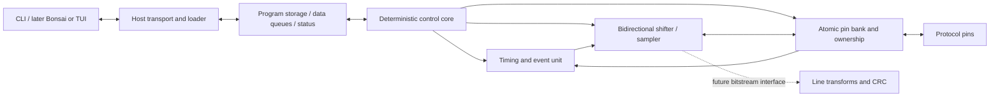

# Protocol emulator construction plan

Status: architecture and integration plan, updated 2026-09-21 for P3.5's independent
hardware loader, 2026-09-20 for P3.1a's bounded program load/access/fetch contract,
P3.2's minimal control execution, and P3.4's host and simulator-session contract, and 2026-09-17
for the implemented `hardcaml_asic` slice (its P0–P3, P4.1–P4.4) and the decision to
develop emulator RTL decoupled from
ASIC adoption (section 1). Sizes and rates remain study parameters; the provisional
instruction names and `m16` encoding are now implemented but are not a frozen ISA.

## 1. Direction and scope

Build a small programmable protocol machine in Hardcaml: a deterministic control
core, reusable I/O engines, and reloadable firmware. UART, SPI, and I2C should be
programs over the same mechanisms. The starting rationale is the repository's
[architecture brief](protemu.pdf), especially sections 3, 6, and 8.

The first useful system should load a program, exchange bytes over protocol pins,
and report what happened. Prioritize UART TX/RX, SPI controller/target, and I2C
controller/target in stages. Preserve room for low-speed USB and 10 Mbit Ethernet
by defining bitstream and timing interfaces now; add their expensive engines only
after baseline measurements justify them. Optional Hardcaml Workbench integration
provides development views; a later operator interface uses the same emulator
host API as the CLI and simulator.

The competition currently specifies IHP 130 nm CMOS5L, a maximum of 6x4 Tiny
Tapeout tiles, and a January 18, 2027 submission deadline. Jane Street is studying
a possible expansion to 8x4 and will announce it if it becomes available. Start
with 6x4 and do not assume the expansion. The competition links the template's
**`cmos5l` branch**. Treat its actual floorplan and flow checks as the area
authority; approximate tile or gate counts are only planning aids.
[Competition announcement](https://blog.janestreet.com/protocol-emulator-asic-competition/)

### Stack ownership and document authority

This repository is the first reference application for
[`hardcaml_asic`](../../hardcaml_asic/docs/architecture.md). Its accepted architecture
owns ASIC project/resource/flow contracts; the
[program-memory contract](../../hardcaml_asic/docs/program-memory-contract.md)
owns `Single_port_ram` behavior. This document owns emulator semantics and the
consumer's integration choices. The [phase plan](phase_plan.md) tracks their
implementation; it does not duplicate the helper library's implementation backlog.

| Owner | Responsibilities |
| --- | --- |
| `hardcaml_protemu` | Core, ISA, assembler, firmware, pin ownership, timing/events/transfers, small FIFOs/register file, loader, host API, reference model, and protocol tests |
| Emulator project declaration | Design constructor, requested harness/technology, clocks and I/O assumptions, metadata/pin meanings, resource policies, and justified flow overrides |
| `hardcaml_asic` | Resource contracts/backends, temporary elaboration context, target resolution, immutable build description, constraints/configuration emission, source sets, collateral, and build/run provenance |
| ASIC Tiny Tapeout integration | Required top-level interface validation, metadata schema/generation, target-derived floorplan/power requirements, and flow staging conventions |
| `hardcaml_workbench` | Optional project sessions, supervised jobs, logs, artifact inspection, and development UI through project-owned commands/driver |

The emulator still implements and verifies its wrapper wiring, reset/disable
logic, and loader. Harness validation does not implement these behaviors. P2's
reusable protocol mechanisms remain emulator logic; they do not become ASIC
resources merely because several protocols use them.

The intended ASIC lifecycle is an immutable project declaration, target
resolution, a fresh `Elaboration_context` for the design constructor, resource
registration/selection, validation, and an immutable `Build`. Constructors
discover resources; the project supplies policies rather than a duplicate memory
inventory. Initial builds explicitly select synthesizable flop program storage.
Unsupported requests fail unless an exact supported implementation or explicit
fallback is allowed. Shape, latency, and behavior must not change silently.

Generated RTL source lists, constraints, flow configuration, and TT metadata come
from that build. Protected target/resource facts cannot be replaced by conflicting
raw settings; permitted overrides carry reasons. Clocks have one declaration with
defined conversions to metadata/SDC units. Existing scripts may consume the bundle;
the optional library runner is not required. Tool/PDK preparation remains an
explicit operation outside ordinary elaboration. Migration preserves the current
P0 path until the replacement passes equivalent checks.

The [Workbench architecture](../../hardcaml_workbench/docs/hardcaml_workbench_architecture.md)
keeps this project independently buildable. Workbench integration is optional and
does not gate emulator hardware, ASIC integration, or tapeout. Sibling links use
this workspace's `scaf`, `hardcaml_asic`, and `workbench` checkout names; they are
documentation references, not build dependencies. Reproduction must resolve and
pin dependencies without requiring those developer-local paths.

### Decoupling RTL from the ASIC tooling

Emulator RTL is developed independently of `hardcaml_asic` adoption. The library
touches the design at exactly three points, all at the project top:

1. the program store, constructed by `Single_port_ram.create` with the elaboration
   context;
2. the project declaration: target, clocks, pin meanings, metadata, resource policy,
   and flow overrides;
3. bundle emission and flow staging, which replace the hand-maintained
   `tinytapeout/` configuration.

Everything else is ordinary Hardcaml (`Scope.t -> I.t -> O.t`) with no context
argument: pin bank, synchronizers/events, timers/waits, shift lanes, FIFOs,
register file, decoder/control core, and the loader. The rules that keep it so:

- Modules that use the program store expose its 1RW port (enable, write-enable,
  shared address, write data, read data) as ordinary ports and are written against
  the [program-memory contract](../../hardcaml_asic/docs/program-memory-contract.md),
  not its constructor. `Elaboration_context.t` is not threaded through the hierarchy;
  only the top-level design constructor instantiates the RAM and connects the port.
  [`protocol_core.ml`](../lib/protocol_core.ml) follows this.
- Emulator testbenches use a small contract model of the store: latency-one reads,
  held output while disabled, and poison after a write or for an unwritten word
  ([`protocol_core_testbench.ml`](../test/core/protocol_core/protocol_core_testbench.ml)).
  Library backend conformance stays in `hardcaml_asic`; adoption later reruns consumer
  checks against its behavioral model.
- Do not instantiate Hardcaml `memory`/`Ram` for the program store, and do not rely
  on asynchronous reads or read-during-write behavior the contract leaves unspecified.
- Keep the Tiny Tapeout wrapper and pin map thin and outside the core, so adoption
  replaces configuration authority without restructuring RTL.

Decoupled code does not mean decoupled measurement. The 6x4 area budget and clock
choices still need early physical evidence, gathered in tiers of increasing cost:

| Tier | Command basis | What it answers | Needs |
| --- | --- | --- | --- |
| Generic estimate | `.venv/bin/yowasp-yosys`: `read_verilog; synth -flatten -top M; stat` | Relative cell/flop counts between candidates, in under a second | `.venv` only |
| Liberty-mapped estimate | Same, plus `dfflibmap`/`abc -liberty` and `stat -liberty` against the pinned `sg13cmos5l_stdcell_typ_1p20V_25C.lib` | Approximate CMOS5L cell area per block | Staged PDK (layer 2) |
| Flow synthesis/hardening | Existing `tinytapeout/` scripts, later an emitted bundle | LibreLane-mapped area, placement, routed timing, checks | Full flow environment |

The first two tiers are not LibreLane's synthesis script and carry no timing; label
their results as estimates. Only flow runs close physical items.

A consequence is that the construction stages in section 8 are not a linear
execution order. Emulator adoption of the library (P0.6/P0.7 in the
[phase plan](phase_plan.md)) may be deferred until the library is consumable from a
separate project (ASIC P5.1) and the emulator has a design worth declaring, while
P1–P3 RTL proceeds against the contract. Deferral is bounded: adoption must land
before Stage 3 exits and before Stage 5 measurements count; the phase plan records
the concrete start trigger. The costs of deferral are accepted
explicitly: Stage 0 cannot exit, flow evidence gathered before adoption is labeled
legacy, and late adoption may surface top-level interface, clock, or metadata
mismatches. Keeping the adoption surface limited to the three points above bounds
that rework.

## 2. What exists today

- `lib/protocol_core.ml`: P3.1a's external-store consumer for the default 256x16 `m16`
  image. It owns sequential load coverage, full-word ordered readback verification,
  executable-image bounds, halted-and-engine-idle host gating, request rejection,
  latency-one fetch ownership, and validity independent of memory data. It has no PC,
  decoder, instruction execution, or engine/pin integration; the first three now live in
  P3.2's `control_execution.ml`/`executable_core.ml`, while real engines and pins remain P3.3.
  `test/core/protocol_core/` compares it with an independent control model and a 1RW
  contract store under varied unspecified outputs.
- `isa/`: the instruction specification (Dune library `hardcaml_protemu.isa`, no
  Hardcaml dependency and no execution), which P1.5 chose and recorded in
  [the decision](p1.5-encoding-decision.md). `instruction.ml` is the instruction set,
  `encoding.ml` the opcodes and field layout, `descriptor.ml` the descriptor fields
  firmware writes, and `program.ml`/`assembler.ml` the labels, images and refusals;
  `kinds.ml`, `pins.ml` and `event_kind.ml` are the enumerations an instruction field
  names. It sits below both `lib/` and `f_model/` because an installed library cannot
  depend on a private one, which is what "shared by assembler and decoder" requires
  here. `Encoding.forms` publishes the field layout as data so P3.2's decoder is built
  from the same values the assembler encodes with.
- `f_model/`: the independent reference execution model (Dune library `protemu_f_model`,
  no Hardcaml dependency), covering P1.1 to P1.5. `machine.ml` holds all model state
  and one rising edge; `operation.ml` is the typed mechanism vocabulary with its
  structural validation; `pin_bank.ml`, `input_pins.ml`, `event.ml`, `fifo.ml`, and
  `transfer.ml` are the mechanisms; `program_store.ml` is a contract model of the 1RW
  store. `firmware.ml` and the `firmware_*.ml` builders are P1.3's labelled operation
  sequences and their independent peers. `control_core.ml` is P1.5's reference core:
  it fetches, decodes and executes an assembled image, and shares `Encoding` with the
  RTL and nothing else. `example_programs.ml` holds the UART, SPI and I2C programs it
  runs. The `study_*.ml` modules are P1.4's encoding comparison and remain frozen
  evidence rather than the ISA: one operation set, two encodings, four
  instruction/memory-word combinations, and a reference core that executes them
  ([the report](p1.4-encoding-study.md)). It is kept out of `lib/` so a diagnostic
  model cannot reach a synthesis source set. Transfers are validated and latched but
  not executed (P2.5). P3.2's RTL decoder and local execution are independently compared
  with this model; delegated mechanisms remain P3.3.
  Tests are in `test/f_model/`.
- `lib/instruction_decoder.ml`, `lib/control_execution.ml`, and `lib/executable_core.ml`:
  P3.2's shared-spec decoder, architectural execution state, and composition with the
  P3.1a access controller. Local state/control instructions execute in RTL; all mechanism
  instructions use one retained P3.3-facing handshake. The implementation and evidence are
  recorded in [the P3.2 record](p3.2-implementation.md).
- `lib/protemu_types.ml`: candidate pin/configure/transfer instruction variants.
- `lib/p0_observable.ml` and `bin/generate.ml`: an observable pin/timer circuit
  and working parameterized Verilog emitter, separate from the control scaffold.
- The P2 primitives in `lib/`: `pin_bank.ml`, `input_events.ml`, `timing.ml`,
  `byte_fifo.ml`, `shift_lane.ml`, `observed_transfer.ml`, `uart_tx.ml`, and
  `primitive_demo.ml`, each compared against a `f_model/` reference in
  the block-owned suites under `test/primitives/`, with `bin/generate_p2.ml` emitting
  standalone Verilog for every block. Their interfaces, contracts, and the latencies measured in
  digital simulation are in the [P2 record](p2-implementation.md). Mapped CMOS5L
  cost for them is not measured (P2.8). `observed_transfer_bank.ml` now exercises one
  observed lane through real pin-bank reservation, arbitration, masked commits and cleanup;
  it is an integration block and measured fixture boundary, not yet the project top or
  core-to-engine arbiter.
- `test/integration/wrapper/` and `tinytapeout/test/tb.v`: focused P0
  Hardcaml/wrapper tests. They do not establish complete pin-bank or UART support.
- `tinytapeout/`: wrapper, metadata, pinned flow inputs, staging, local checks,
  and the flow scripts. The observable circuit has hardened to GDS on CMOS5L on
  both paths — the legacy hand-maintained one and the emitted bundle — with
  signoff, precheck, and gate-level wrapper tests passing. See the
  [P0 record](../tinytapeout/reports/2026-09-14-p0-tool-path.md), the
  [P0.5a legacy record](../tinytapeout/reports/2026-09-19-p0.5a-legacy-physical.md),
  the [P0.5b adopted record](../tinytapeout/reports/2026-09-19-p0.5b-adopted-physical.md),
  the [P0.5c clean-staging reproduction](../tinytapeout/reports/2026-09-20-p0.5c-clean-staging-physical.md),
  and [flow.md](flow.md) for the flow itself. P0.7 has since taken registered program
  memory through backend integration and mapped synthesis; its record is linked below.
- `hardcaml_asic` (its [phase plan](../../hardcaml_asic/docs/phase_plan.md), reviewed
  2026-09-17): P0–P3 and P4.1–P4.4 have evidence. Implemented are the
  `Project`/`Elaboration_context`/`Build` lifecycle with resource identity and
  selection policy; `Single_port_ram.create` with a behavioral model and explicitly
  selected flop storage passing a conformance suite; TT/CMOS5L target resolution with
  validated flow configuration; deterministic bundle emission (RTL, source sets, SDC,
  TT metadata, manifest); and run records with structured result collection. Mapped
  CMOS5L synthesis evidence exists for a 4x8 flop-memory example (179 cells, about
  3,480 µm²). Its small physical path (ASIC P4.5) and consumer packaging (ASIC
  P5.1) have since closed as well. This repository's P0.6/P0.7 adoption and
  clean-staging physical reproduction close ASIC P5.2–P5.4. Still open are usage
  documentation (ASIC P5.5) and the SRAM investigation (ASIC S). This repository
  now depends on the library:
  `bin/asic_bundle.ml` declares the adopted design against it and takes its
  wrapper ports, reset idiom, and LibreLane defaults from `Tt_cmos5l`, pinned by
  revision in [`asic-dependencies.lock`](../tinytapeout/asic-dependencies.lock).
  `lib/` itself still lists no `hardcaml_asic`, which keeps the hardware library
  independent of the build path.
- Dune, Hardcaml dependencies, and `scripts/with-switch.sh` are already present.

Keep developing this scaffold, but do not treat the provisional 16-bit `m16` memory layout
or fetch/decode sequence as a final physical-memory decision. Transport byte addressing,
instruction width, and physical memory-word width remain separate concerns.

## 3. Initial architecture

Start with one control core and one transfer engine. The transfer engine can
shift TX and RX together, but that does not imply two independently timed serial
channels. Measure whether UART full duplex requires a second small timing/shift
lane. Keep that replication possible without changing the host or pin interfaces.

Use one system clock initially. Dividers generate clock-enable pulses and output
pin transitions, not new internal clock domains. External SPI clocks are observed
as synchronized inputs, with a documented maximum rate and minimum pulse widths.

### Primitive contracts

| Primitive | Initial contract | Why it matters |
| --- | --- | --- |
| Pin bank | `pin_in`, registered `pin_out`, registered `pin_oe`; masked atomic updates of value and enable | Push-pull SPI/UART, I2C drive/release, later bus turnaround |
| Input front end | Two-stage synchronization baseline, coherent registered snapshots, rise/fall detection; configurable filtering considered separately | External edges are asynchronous; filtering changes latency |
| Timing | Countdown, periodic tick, level/edge wait with timeout; phase restart from an observed event | Baud timing, clock generation, receive alignment, stretching |
| Transfer | Configurable bit count/order, separate input/output pin selection, initial output preload, launch/sample phases, internal or observed-edge pacing | Repetitive shifting without a control instruction per bit |
| Event/status | Latched completion/error/timeout, explicit acknowledge, overflow indication | Events remain visible while the core is busy |
| Buffering | Small TX/RX FIFOs with explicit full/empty and ready/valid behavior | Decouple host/core work from a transfer already on the wire |
| Control/storage | Branches, loop counter, small registers, program load/readback, bounded instruction timing | Protocol semantics remain firmware-controlled |

The primitive interfaces should describe mechanisms such as launch edge, sample
edge, and drive mask. Protocol names belong in firmware builders and tests.

### Pins, reset, and ownership

Use eight bidirectional protocol pins as the first logical bank. Represent
tri-state behavior with separate data and output-enable signals inside the core;
the Tiny Tapeout wrapper connects them to the pad-facing interface.

For open drain, always drive a zero: `pin_out = 0`, `pin_oe = drive_low`.
Releasing a pin is `pin_oe = 0`; a board pull-up supplies the high level. Sample
the actual input while driving or releasing. Do not infer a high bus level from
the value we intended to transmit.

A transfer claims its configured output pins until completion or abort. Reject
overlapping software writes or another engine's claim with a sticky ownership
fault. The sticky fault records the attempt, not the outcome: a request that named
a pin another owner holds sets it even when that same edge was refused for an
unrelated reason, such as two requests offered at once. Inputs may be observed by
several consumers. Change ownership only at a defined clock boundary, and commit
output value and enable together.

On reset, release protocol pins, clear queue validity and event state, and halt
execution. Do not depend on uninitialized program/data memory. Load and verify a
program before allowing RUN. Define wrapper reset polarity conversion and
synchronized reset release explicitly. Disabling the design should abort work
and release protocol pins; ordinary core waits must leave active engines running.

### Timing and event semantics

Write these rules into the reference model before implementing the ISA:

1. Commands are accepted on a rising system-clock edge when ready and valid are
   both asserted. Their parameters are latched at acceptance.
2. Pin writes take effect at a documented commit edge. A timed command accepted
   at edge `k` with delay `n >= 1` fires at `k+n`. Reject zero delay initially.
   Timed transfer phases must remain independent of instruction-fetch overhead.
3. A level wait may complete immediately if the synchronized condition is already
   true. An edge wait arms for subsequent observed edges, avoiding stale events.
   If a matching event and timeout occur together, the event wins.
4. Completion and error status remain set until acknowledged. Define simultaneous
   set/ack behavior as set-wins, so a new event cannot be erased accidentally.
5. An engine may wait for a FIFO before starting. Once a wire operation starts,
   it may pause only at an explicitly allowed boundary. Otherwise underrun or
   overrun reports a fault and invokes a configured safe abort action.
6. Distinguish core single-step from engine execution. For initial debugging,
   single-step only with engines idle; STOP requests a boundary stop, while ABORT
   releases pins promptly and marks the transaction incomplete.

Two synchronizer stages are a starting implementation, not a guarantee of a
fixed external-edge latency. Clock phase, synchronizer behavior, filtering, edge
detection, control dispatch, and output registers all contribute. Measure the
normal digital latency range and assess metastability reliability separately.
Do not independently synchronize a data bus and assume its bits remain coherent.
For SPI sampling, align SCK, CS, and data pipelines and verify the device's setup
and hold requirements over all relevant input phases.

Record two latency paths: event-to-engine response and event-to-core-decision-to-
pin response. Target modes may need the first even when controller modes work
with the second. A sticky bit records occurrence, not event multiplicity; use an
event counter or queue if a workload must distinguish successive events.

### Transfer descriptor, before opcode encoding

Model descriptors as typed OCaml values first. Candidate fields are TX value,
bit count, bit order, input pin, output pin, optional clock pin, idle output/clock
values, initial delay, launch phase, sample phase, and internal/external pacing.
Validate pin conflicts and impossible phase combinations on issue.

Start with a 32-bit shift register and lengths 1..32 as an experiment. Support
TX-only, RX-only, and simultaneous TX/RX. UART framing can be assembled into a
shift word or sequenced around a data transfer. SPI mode configuration maps to
preload and launch/sample phases. For I2C, begin with explicit drive/sample/wait
steps; a blind eight-bit transfer is insufficient for stretching or arbitration.

Allow an observed event to arm or start a preconfigured operation without a
software round trip. This generic facility is a candidate for UART start-bit
alignment and externally clocked shifts. Add a second descriptor slot only if
gap-free traffic measurements show that software cannot refill in time.

For a wire clock, `idle_clock` defines the physical initial level and the first transition
is the leading edge. An alternating external clock is represented by `Either`; the lane
then maps physical leading/trailing edges to configured launch/sample phases. A rise-only
or fall-only source supplies ordinal events and does not by itself represent both halves
of a wire clock. Tests and firmware must not infer all SPI modes from changing
`idle_clock` or an internal phase toggle without an independent peer checking the physical
edges. A transfer-to-bank bridge reserves the output mask when arming, before an observed
start can activate it, and clears output enable in one bank commit before a separate
ownership release. Local select cancellation must not use the bank's global abort, which
would also clear unrelated software ownership.

## 4. Minimum control ISA and memory study

| Family | Candidate operations | Initial decision |
| --- | --- | --- |
| State | Load immediate, move, add/subtract, AND/OR/XOR, compare | Small register set, simple flags; omit multiply/divide |
| Flow | Jump, branch on flag/event/pin snapshot, decrement-and-branch, halt | Publish cycle counts for every path |
| Pins | Masked value/enable write, read snapshot | One atomic pin commit |
| Time | Wait cycles, wait level/edge with timeout | Wait stalls control, not engines |
| Engine | Configure, issue transfer, wait completion, read result/status | Configuration can take several instructions |
| Data | FIFO push/pop and status | Specify blocking and nonblocking forms before encoding |

Use an OCaml assembler/library with labels and validation before designing a
textual DSL. Firmware helpers such as `uart_tx` should expand into this ISA.
Keep the instruction specification shared by assembler and decoder, while the
reference execution model stays independent of the Hardcaml implementation.
P1.5 has done this: `isa/` is the shared specification, `f_model/control_core.ml` the
independent execution, and [the decision](p1.5-encoding-decision.md) records what was
chosen. The comparison below is P1.4's and is now settled evidence rather than open
work; sizes and cycle counts remain in [its report](p1.4-encoding-study.md).

Compare fixed 16-bit instructions with occasional extension words against a
simple fixed 32-bit encoding. Start the study with eight 16-bit registers,
128/256 memory words, and 4/8/16-entry byte FIFOs. These are sweep points.
Instruction width and physical memory-word width are separate choices: record
packing, extension-word layout, byte order, and fetch count for each encoding.
Record firmware size, cycles per operation, and mapped area for each choice.

For perspective, 256x16 program bits plus two 16x8 FIFOs already total 4,352
storage bits before registers and metadata. That can dominate a small design if
implemented in flip-flops. Use `hardcaml_asic.Single_port_ram` through the
elaboration context at the project top, with consumers coded against its port
(section 1, decoupling). Its normative contract is single-port 1RW with one shared
address, latency one, held output when disabled, unspecified output after a
write, and no initialization/reset. An enabled operation is a read or a write;
the primitive supplies neither byte enables nor a second read port. Out-of-range
accesses are outside its contract. Small FIFOs and the multi-port register file
remain emulator-owned flop logic in the initial implementation.

The loader assembles complete configured memory words before issuing writes;
this does not select a 16-bit ISA. Initially both host program writes and readback
require the core halted and engines idle. Requests during execution are rejected
without stealing a fetch cycle. Concurrent access would require a new arbitration
and timing contract or another memory shape. Status/data-queue host operations
remain separate from this program-memory restriction.

The emulator owns program validity, access gating, bounds/loaded-image validation,
and fetch-pipeline validity. Reset validity and halt execution without bulk-resetting
RAM. Load, read back, and verify a complete declared image before RUN; prevent
fetch outside that verified image and reject partial transport words. A write or
an unwritten location must never supply a valid instruction. Model fetch latency,
stalls, branches, and extension fetches independently of the RAM implementation.
Any ROM is a deliberate hardware implementation, not an assumed power-up file load.

### Program load, access, and fetch contract

P3.1a fixes the first consumer configuration at 256 16-bit memory words. Addresses at
the store port are memory-word addresses; the host and fetch interfaces carry nine-bit
unsigned addresses or lengths so values at and above 256 are rejected before the
eight-bit physical address is formed. This configuration directly supports P1.5's
default `m16` image, one 16-bit instruction slot per memory word. A later packed `m32`
selection changes the configured word width and slot extraction in P3.2, not the access,
verification, or 1RW timing contract.

An image always starts at word zero and has a declared length from 1 through 256. The
small bounded loading protocol is deliberately sequential rather than carrying a
per-word validity bitmap:

1. An accepted load-start declares the length, invalidates any executable image, clears
   prior progress and verification failure, and starts a replacement session.
2. A write is accepted only at the session's next address, beginning at zero, and only
   below the declared length. An accepted write advances that address. Missing and
   duplicate writes therefore cannot complete; an out-of-order or out-of-range offer is
   rejected without touching the store or changing progress. A new accepted load-start
   interrupts and replaces an incomplete session.
3. After every declared word has been written, verification reads are accepted only in
   the same zero-based order. Each request carries the expected complete memory word.
   The core issues a normal latency-one store read, associates its saved expected word
   with that response, and advances verification only on equality. A mismatch latches a
   verification failure; recovery requires a new load-start. Ordinary readback uses the
   same response timing but does not advance verification.
4. Load-complete is accepted only after all declared words have produced matching
   verification responses, with no read outstanding and no verification failure. This
   is the concrete meaning of "verified": hardware checks accepted write coverage,
   ordered read coverage, and every full-word comparison. The P3.5 loader supplies the
   declared length and expected words after assembling complete little-endian transport
   words; it cannot authorize an image with an unchecked pulse.

Zero and oversized lengths are rejected and preserve the previously valid image. Once a
valid load-start is accepted, however, the old image is immediately non-executable, so a
shorter replacement can never expose its tail. Reset halts execution, cancels a load
session and every outstanding response, clears executable-image metadata, and leaves RAM
contents untouched. Disable has the same control-pipeline cancellation and halt effect
but preserves a completed image; it neither reads nor writes the store.

Host writes, readback, load-start, load-complete, and RUN require the core halted and the
explicit `engines_idle_i` input high. A readback address must be below the accepted-write
count of an active load or below the completed image length otherwise. Only one host read
may be outstanding. Every offered request has an accepted or rejected indication; a
rejection has no store or control-state effect. During execution all host program-memory
requests are rejected and fetch retains the port, address, and state it would have had
without them.

An accepted RUN requires a completed image, idle engines, and no outstanding read. It
enters the running state but does not itself fetch. P3.2 supplies word-addressed fetch
requests. A legal request while running issues one store read and returns
`fetch_response_valid_o` with the word exactly one edge later. No response validity is
inferred from data. A request at or beyond the completed image length, including an
address at or above physical depth, issues no read, latches a fetch fault, and halts.
P3.2 supplies `execution_halt_i` when an executed Halt, invalid instruction, STOP, or
other defined boundary returns control; ordinary absence of a fetch request stalls with
the port disabled. At most one fetch is outstanding, preserving P1.6's non-overlapped
fetch schedule.

At one edge the priority is synchronous reset, disable, execution halt or invalid fetch,
load-start, write, readback, load-complete, RUN, then an otherwise legal fetch. Host
operations are considered only while halted, and fetch only while running, so the latter
groups do not contend in a legal state. Higher-priority accepted work rejects simultaneous
lower-priority offers. Reset, disable, execution halt, accepted load-start, and invalid
fetch discard outstanding response ownership; held, stale, post-write, and unwritten RAM
outputs consequently cannot assert either registered response-valid signal. A host response
that is due is delivered before another host read may be accepted. The execution completion
turnover used for extension fetches is specified below.

### Minimal control-execution contract

P3.2 keeps the default `m16` layout: one sixteen-bit instruction slot is one
program-memory word. An accepted RUN starts a fresh execution. It clears the PC to zero,
all eight registers, the zero/carry/negative flags, the transfer descriptor, retained
instruction state, execution counters, normal-halt indication, and the preceding execution
fault. Program-image validity remains P3.1a state and is not changed by RUN. Reset clears
both access and execution state. Disable cancels outstanding execution work and halts while
P3.1a preserves a completed image. Normal Halt and an execution fault preserve already
committed registers, flags, descriptor fields, and counters for inspection; a later RUN
starts fresh again.

The latency-one RAM value is consumed at the edge after its read was accepted. P3.1a
therefore exposes an execution completion directly from pending response ownership and the
current RAM output, in addition to its retained registered response observation. A due
completion may release the outstanding slot and accept the next read on the same edge. P3.2
uses that turnover only to acquire an extension word: ordinary instruction fetch and
execution do not overlap. Under `m16`, an ordinary successful instruction costs one accepted
fetch edge and one execute edge; an extended instruction costs two accepted fetch edges and
one execute edge. Halt includes its execute edge. A base or extension word rejected before
execution has no execute edge. The RUN edge and host loading/readback edges are not program
cycles.

P3.2 executes Halt, Ldi, Mov, Alu, Alu_imm, Cmp, Cmp_imm, Shift, Jump, Branch,
Dbnz, Call, Jump_reg, and Config locally. Every other defined P1.5 opcode is decoded and
offered through one P3.3-facing mechanism port; none is a successful no-op. The request has
a typed kind and retained operands and remains stable until accepted or refused. Acceptance
may coincide with completion. After acceptance the request is not reissued, and delayed
completion stalls the core with fetch disabled. A result is committed only on successful
completion. Refusal, completion fault, and a completion with no outstanding operation are
execution faults. Reset or disable wins over acceptance/completion and cancels retained
mechanism state. STOP, ABORT, single-step, and connection to actual pin, timer, event,
transfer, and FIFO mechanisms remain P3.3.

Control-flow arithmetic is performed wide enough to retain a negative or large target
before any request-address narrowing. P3.1a remains the sole owner of physical-depth,
loaded-image, and executable-image bounds. A target that cannot be represented on its
nine-bit fetch request is an execution target fault; a representable request outside the
physical or loaded image is P3.1a's fetch-bounds fault. A taken control instruction commits
its specified register effect and retires before a later target fetch faults, matching the
reference core. A required extension commits no architectural state until it is fetched and
validated.

Normal Halt is not an error. Execution fault reporting distinguishes a malformed base word,
a malformed extension, a truncated extension/fetch-bounds failure, an unrepresentable
target, mechanism refusal, mechanism completion fault, and unsolicited completion. It
retains both the instruction slot and relevant fetched/requested slot. An instruction
boundary pulse accompanies successful retirement, normal Halt, or a terminating execution
fault. Retirement is separate: refused, malformed, truncated, and faulting mechanism
operations reach a boundary but do not retire. P3.3 consumes this boundary for STOP rather
than redefining it.

### Core-to-mechanism integration contract

P3.3 fixes the first integrated configuration to one pin bank, one timing block, one shift
lane, and separate eight-entry TX and RX byte FIFOs. The mechanism reason byte is stable at
this boundary: `0` is no reason, `1` unavailable/busy, `2` invalid parameter, `3` pin
ownership conflict, `4` FIFO full, `5` FIFO empty, `6` FIFO data out of range, `7`
cancelled, and `8` primitive/engine failure. The execution core still classifies refusal
and delayed failure separately; the reason byte only preserves the mechanism detail.

Pin and status reads, pin branches, acknowledgements, accepted pin writes, periodic
start/stop, and FIFO operations that can transfer immediately accept and complete on the
same edge. Timing waits accept once and complete from the timing block's later completion
or timeout pulse; an already-satisfied level wait completes immediately and does not set a
wait-complete event. A blocking FIFO operation accepts once and remains owned by the
adapter until its queue transfer occurs. A pressured nonblocking FIFO operation is
refused. `Issue_transfer` is nonblocking with respect to the wire: a valid descriptor and
available lane accept and complete the instruction together, after which the lane runs in
the background. A busy lane is unavailable rather than an implicit command queue.

The descriptor's sixteen-bit TX field is the only transfer source in this configuration.
It may describe a longer RX transfer, or a longer TX/duplex transfer whose upper transmitted
bits are zero, but it cannot encode arbitrary nonzero TX bits 16 through 31. The byte FIFOs
remain explicit firmware/stream queues: P3.3 does not invent byte packing between them and
the descriptor. TX stream consumption and RX stream production are exposed independently,
and their arbitration must not starve an active lane. A later queue-fed descriptor mode
requires an ISA and packing decision. Observed pacing uses the shared synchronized input
front end; the pacing pin and edge latch with the accepted descriptor. The current
descriptor has no observed-start selector, so issue starts the lane immediately and
subsequent selected input edges pace it.

STOP, ABORT, single-step, and host RUN have priority after reset/disable in this order:
ABORT, STOP, single-step, RUN. STOP records a pending boundary request and suppresses the
next fetch when P3.2 raises its existing instruction boundary; work already accepted by a
background engine continues. ABORT suppresses mechanism issue/completion on that edge,
cancels the core operation and timing/FIFO ownership, releases the lane and all bank claims
at that edge, and records `Aborted` when work was in flight. Single-step is accepted only
while program access reports halted, the integrated engine-idle predicate was true before
the edge, and execution is paused rather than terminally faulted or normally halted. It
resumes preserved architectural state, executes through extension acquisition and any
instruction stall, and stops at exactly one P3.2 boundary without using a clock gate. An
ordinary RUN remains a fresh run and clears architectural state.

The integrated engine-idle predicate requires no timing wait, no accepted blocking FIFO
operation, no active/armed transfer or bridge cleanup, no engine pin claim, and no pending
engine bank effect. Periodic timing, FIFO occupancy, and software pin claims do not make an
engine busy. Consequently a stopped core does not by itself permit program-memory access:
P3.1a continues to require both halted and this real engine-idle predicate.

Start with an explicitly selected flop implementation. Investigate CMOS5L macro
availability early, but begin a macro backend only after exact shape/behavior,
complete model/Liberty/LEF/GDS and power views, target permission, and flow
compatibility are established. PDK presence alone proves none of the latter
requirements. The helper library owns backend implementation/conformance; the
emulator owns workload/area comparisons and target acceptance evidence. Unsupported
macro-required builds fail; fallback requires explicit policy and a recorded reason.
The first working slice and first ASIC project do not wait for a macro.

## 5. Protocol milestones and acceptance tests

The rates below are proposed test targets, conditional on routed timing and the
board interface. Support one selected protocol at a time initially.

| Protocol | First demonstration | Baseline completion | Important failure/timing tests |
| --- | --- | --- | --- |
| UART | Programmable 8N1 TX at 115,200 baud, then RX | Back-to-back TX/RX; sweep toward 1 Mbaud; evaluate simultaneous independent TX/RX | Start detection at varying clock phases, false start, framing error, baud mismatch sweep, FIFO faults |
| SPI controller | Mode 0 byte exchange | All four CPOL/CPHA modes, both bit orders, selected widths 1..32, CS across multiple words; study 1 MHz then 5 MHz | First/last-bit placement, CS timing, pause boundaries, unequal half-periods |
| SPI target | Preloaded response at a conservative clock | All four modes within a measured external-clock envelope | CS assertion/abort, first-bit preload, minimum SCK high/low time, setup/hold, underrun; target cannot stretch SCK |
| I2C controller | 100 kbit/s, 7-bit address, write/read with ACK/NACK | Repeated START, final-read NACK, STOP, clock-stretch wait and timeout; evaluate 400 kbit/s | Released SCL still low, stuck bus, NACK paths, arbitration loss injection and release |
| I2C target | Address match and one-byte response | Read/write sequences, repeated START/STOP, ACK/NACK, intentional stretching | SDA stability while SCL high, external STOP during waits, response latency, read termination |

I2C terminology, bus behavior, and timing should follow
[NXP UM10204](https://www.nxp.com/docs/en/user-guide/UM10204.pdf).
Model the pull-up and multiple open-drain drivers in the testbench. Full
multi-controller clock synchronization/arbitration, 10-bit addressing, and faster
I2C modes are later coverage; detecting a forced arbitration loss alone is not
complete multi-controller support.

UART full duplex is an explicit architecture decision after the single-lane
measurements. A duplex SPI shifter uses one shared bit clock; two UART directions
can have unrelated frame starts and require independent schedules.

## 6. Keeping USB and Ethernet possible

Reserve a logical bitstream boundary with data, valid/ready, stream boundaries,
and error metadata. Future transform stages must distinguish a logical bit
consumed from a physical symbol emitted: stuffing changes the relationship.
Backpressure inside the chip must never silently stretch an in-progress waveform.
Define buffer sizing and abort behavior before claiming continuous streaming.

Candidate later primitives:

- Bit-serial configurable CRC/LFSR, initially widths up to 32. Specify polynomial
  representation, shift direction, initialization, reflection, and final XOR.
  Start with one logical bit per tick; compare byte-parallel area only if needed.
- Stateful invert/XOR/NRZI and Manchester transforms; configurable run-length
  insertion/removal. Compare a small set of reusable operations against a LUT/FSM
  implementation using measured area and achievable symbol rates.
- Edge-interval capture and phase correction for receive clock recovery.
- Descriptor chaining and sustained FIFO service where packet timing requires it.

For USB low speed, first model logical line states, NRZI, stuffing, CRC5/CRC16,
and packet boundaries, then test receive recovery and response deadlines. A
packet loopback test is distinct from a usable device with enumeration, reset,
control requests, and turnaround handling. Keep protocol semantics in firmware.
Use the [USB 2.0 specification](https://www.usb.org/document-library/usb-20-specification)
as the reference when fixing those requirements.

For Ethernet, choose the electrical boundary before promising 10BASE-T support:
a digital connection to an external PHY and generating/recovering Manchester at
a line interface are different projects. Start with a modeled bitstream, CRC32,
and framing throughput. A direct line-interface study must also cover receive
clock recovery, link behavior, and any required collision behavior. Budget pins
and host bandwidth for whichever boundary is selected.

Illustrative arithmetic, assuming a *hypothetical* 48 MHz system clock:

| Workload | Available clock budget | Implication to investigate |
| --- | --- | --- |
| 1 Mbaud UART | 48 cycles/bit | Plenty of bit time, but RX phase and dispatch latency still matter |
| 5 MHz SPI | 4.8 cycles/half-period on average | Exact uniform half-periods need a compatible clock/divider; phase-dependent target response is tight |
| 1.5 Mbit/s USB low speed | 32 cycles/bit | Plausible study point for autonomous timing; not a compliance result |
| 10 Mbit/s Manchester stream | 4.8 cycles/bit, 2.4 cycles/half-bit on average | Receive recovery and non-integer timing are major constraints |

48 MHz is not an achieved ASIC clock. Compare suitable external clock choices
and integer/fractional schedules; quantify jitter before using fractional ticks.
Neither generic GPIO nor successful digital simulation establishes a compliant
USB or Ethernet electrical interface. Board transceivers, pull-ups, line drivers,
termination/magnetics as applicable, voltage levels, and Tiny Tapeout I/O delay
belong in the feasibility study. Extensibility before fabrication still requires
real hardware resources; a future firmware update cannot add a missing PHY.

## 7. Host control now, application later

Define a transport-independent OCaml host API: identify/version/capabilities,
load/read program, configure pins, enqueue/dequeue data, run/stop/abort, inspect
registers and engine status, and retrieve bounded trace events. Program-memory
readback and writes initially require halted execution and idle engines, as in
section 4; inspection of status is not a second memory port. Make protocol
examples runnable through a simulator backend before real hardware exists.

The P3.5 physical loader is a slow host-clocked, mode-0-style serial debug link
using dedicated Tiny Tapeout pins: `ui[0]` active-low select, `ui[1]` host clock,
`ui[2]` host-to-device data, `uo[0]` device-to-host data, and `uo[1]` response
ready. The remaining `ui` and `uo` bits are reserved and driven low; all eight
`uio` pads remain the programmable protocol bank. The host clock is observed in
the 48 MHz system-clock domain through two-stage synchronizers rather than forming
a second clock domain. Host high and low phases, select lead/trail, and input-data
setup/hold are each at least four system-clock periods, giving a specified maximum
continuous symmetric bit clock of 6 MHz at 48 MHz. Complete request/response time also
includes selected-frame lead/trail, inter-frame high time, response readiness, and any core
completion latency. This is a digital capture envelope, not a physical metastability or
board-timing result.

The bounded version-1 wire protocol is detailed in
[`p3.5-hardware-loader.md`](p3.5-hardware-loader.md). A selected request carries a
magic byte, version, transaction tag, command, little-endian payload length, at
most four payload bytes, and CRC-8/ATM. The eleven-byte derived maximum uses a saturating
count and sticky overrun, so neither a counter wrap nor a valid-looking suffix can restore
eligibility. Selection loss terminates the frame; only an exact, complete,
version-compatible, length-consistent frame with a matching CRC can reach dispatch.
Commands cover discovery/status, load-start, one complete
word write, one read or verification read, load-complete, RUN, STOP, and ABORT.
The loader presents those operations once to `Integrated_core`; it never accesses
RAM or image-valid state directly. A response is retained until explicitly committed.
The host samples the final bit on a rising edge and validates the complete CRC while the
clock remains high. Deselecting before the final fall rejects the received copy and keeps
the response for replay; supplying the final fall and then deselecting commits consumption.
While a response is pending, a selected transfer reads that response rather than accepting
a new command. An early selection during dispatch or completion is not accepted and cannot
alter retained command context; the host must deselect and begin a later legal transaction.
There is no inactivity timeout, so a selected host may pause indefinitely.

This per-command framing deliberately avoids a 512-byte image buffer. An accepted
load-start invalidates the prior image, each write frame can issue only one fully
assembled 16-bit word, and the host supplies each expected word again for the
ordered hardware verification pass. A malformed write frame therefore cannot
issue a partial word. Interruption after load-start may leave earlier writes in RAM
but cannot make the image executable; a new valid load-start replaces that session.
STOP acknowledges boundary-request acceptance and may remain pending. ABORT does
not complete on acceptance: its response waits for the post-edge halted,
engine-idle, claim-free, output-disabled state. Thus ABORT followed by a replacement
load is the fixed recovery path for looping, waiting, faulted, or engine-owning
firmware. Reset clears loader state and image validity; disable cancels parser and
load-session state while preserving a previously completed image, consistently
with the existing core contract.

Keep register addresses and binary transport versioned; expose capabilities for
memory width/depth, pin count, engines, and ISA version. A CLI should load firmware,
send/receive bytes, and export timestamped traces. Keep these commands usable
without a UI. A later operator interface can use the same API through a local
service, with its placement decided after the device workflow works.

P3.6 must add queue transport before the physical workflow can exchange application data.
The current wire protocol does not support step, pin configuration, or trace, and compact
STATUS is not the full portable inspection record. The backend must define transport errors
for currently infallible status methods, map cycle budgets to physical polling/time, and
decide whether stable wire refusals need richer host errors. These are backend/API handoff
items; they do not reopen P3.5 framing and are not implemented by the loader repair.

P3.4 settles the software boundary in [`host/host_api.ml`](../host/host_api.ml). API and
abstract operation-protocol version 1.0 identify this software contract, while ISA identity
`protemu-p1.5` version 1 and image-format version 1 identify program compatibility.
Discovery advertises only the implemented `m16` configuration: 256 sixteen-bit memory
words, word addresses, complete words in a metadata-bearing S-expression, and
little-endian byte order for the P3.5 serial byte transport. The file representation does not
accept raw or packed bytes, so an incomplete trailing word is not representable; `m32`
images are rejected before load-start. Pin configuration at this boundary is the
architecture's software claim/release operation. Direct pin writes remain firmware
instructions, while asynchronous pad value and external occupancy are explicitly
simulator-only facilities. A claim or release that overlaps engine ownership is refused
without changing either owner or the driven output.

The first backend, [`host/simulator_backend.ml`](../host/simulator_backend.ml), owns one
`Integrated_core`, one contract-compatible latency-one RAM, and one clock for the lifetime
of a CLI script. Session creation applies reset, then presents cycle zero with no valid
image, empty queues, zero external pads/occupancy, an enabled empty trace, and a monotonic
cycle counter. For an advancing operation the backend drives persistent pad state and the
host request, settles combinational logic, samples acceptance and the memory request before
the rising edge, advances the edge, services the external RAM port, and samples registered
state. A read request takes its acceptance edge plus one response edge. This fixed-latency
response is a backend invariant, not an ordinary retryable transport timeout. Load uses the
exact load-start, ordered-write, ordered hardware-verify, load-complete sequence. Discovery,
status, loaded-image inspection, compatibility checks, trace retrieval/clear, and changing
the next external-pad stimulus do not advance time. Pin claims, accepted queue transfers,
control offers, and program operations do.

Explicit `advance` and finite `wait-halted`, STOP, step, and queue waiting budgets are the
only way idle/background cycles pass. Queue budgets count cycles spent waiting; each
accepted byte still consumes one deterministic edge. A zero budget is nonblocking and a
blocked operation advances no edge. Host TX means host-to-device and enters the DUT RX
FIFO; host RX drains the DUT TX FIFO. Results preserve requested and transferred counts.
A timeout after an accepted STOP or step reports `accepted = true` and neither aborts nor
resets the device; the request remains governed by hardware until later clocks or an
explicit ABORT. RUN returns on acceptance rather than waiting for program termination.
Ordinary status, trace, and queue operations remain available while execution owns program
memory. Program requests are still offered once to hardware and a refusal is reported; the
backend never retries a side effect.

Ordinary completed-image reads use all-or-error range semantics. The simulator validates
the complete physical and verified-image range before the first read edge, so an
out-of-image range returns `Image_bounds` with no partial progress and no time advance.
No image, active execution, and active engines have distinct refusal reasons. An unexpected
mid-range hardware refusal still reports its failing address, completed count, and prior
words in `Read_failed`; a missing accepted latency-one response is a backend-invariant
failure. `verify_image` distinguishes no image, incompatible loaded length, and a data-word
mismatch without invalidating a valid image.

Queue operations return partial progress as successful `Transfer` values. An exact-transfer
presentation such as the CLI converts `Would_block` or `Timed_out` to an error only after
preserving requested/transferred counts and received data. The latter uses the distinct
stable code `transfer_timeout`; a caller resumes only the remaining count and must not
repeat already transferred bytes. ABORT completion is sampled from its post-edge halted,
engine-idle, ownership-released and output-disabled state rather than inferred solely from
acceptance.

The simulator trace is observation storage, not synthesizable hardware. It samples after
each rising edge in stable host-operation, instruction, mechanism/engine, pin-transition,
fault order. Records use the session cycle as timestamp and a monotonic cursor sequence.
The fixed-capacity ring drops the oldest record, retains a cumulative sticky loss count,
and never stalls execution. Retrieval and clear do not advance time. Retrieval is a
snapshot after an optional cursor; clear removes retained records and clears loss state but
does not rewind sequence numbers. A new session starts with an empty trace and sequence
zero. Sequence and loss values are nonnegative OCaml `int` values; sessions that would
exceed `Int.max_value` are outside this in-process backend's supported lifetime, rather than
having defined wraparound semantics. Physical trace storage and physical-backend transport
timeouts remain P3.6 rather than being inferred from this backend. P3.5 now fixes serial
framing, acknowledgement, wire encodings, response replay/commit, and compact INFO/STATUS
records.

Development integration with Hardcaml Workbench is a separate optional track:
generic Dune commands first, then a small versioned manifest and a project-side
driver built in this project's environment. The driver exposes target/configuration
discovery, elaboration, generation, tests, and ASIC build/run artifacts as supported
by the Workbench protocol. It reads project declarations/builds rather than copying
target, clock, or memory policy into a second configuration authority. Workbench
owns the job and UI; the ASIC adapter owns build/flow semantics. Link Workbench
jobs/artifacts to ASIC build and execution identities.

Use Workbench's generic hierarchy, waveform, log, and report views where supported.
Emulator firmware loading, data exchange, and recovery remain P3 API operations;
a device-control extension is not yet specified by Workbench. Bonsai Web is already
Workbench's primary frontend. An emulator operator UI or terminal client remains
a separate product decision; neither is required for hardware acceptance.

## 8. Construction sequence

| Stage | Deliverables | Exit evidence |
| --- | --- | --- |
| 0. Make the tool path real | Observable pin/timer path; ASIC project declaration and emitted bundle; small registered flop-memory integration; prepared physical environment | Wrapper regression, memory integration and mapped synthesis pass; an adopted-bundle design completes CMOS5L hardening/precheck and gate-level checks |
| 1. Define execution | Cycle model, typed instructions/descriptors, pin/timing contracts, assembler helpers | UART/SPI/I2C examples execute in the model; latency and program-size report |
| 2. Implement primitives | Pin bank, synchronization/events, timer, shifter, small FIFOs, unit tests | Model/RTL agreement and edge-case properties; mapped area per block |
| 3. Make it reloadable | Control core, context-registered program store and consumer validity/arbitration, independent loader, CLI simulator/device API | Load/readback/run two different protocol programs without regenerating RTL |
| 4. Complete baseline | Firmware and independent peers for UART, SPI controller/target, I2C controller/target | Coverage matrix with rates, timing margins, faults, and concurrency limits; FPGA exercise if available |
| 5. Select physical architecture | Memory/FIFO/engine sweeps; repeated place and route; USB/Ethernet feasibility experiments | Chosen configuration fits the authorized 6x4 allocation with routed timing and resource margin; stretch limits documented |
| 6. Prepare tapeout | Reproducible ASIC bundle/export and dependency resolution, gate-level regression, physical checks, pinout and bring-up guide | Complete submission artifacts with tool/PDK revisions, timing results, clean required checks, and recovery procedure |
| Later. Application | Optional Workbench driver/artifact integration and an operator interface over the host API | Independent CLI remains usable; supported views preserve build/run identity and device operations/errors |

Stages 0 and 1 should interleave: a small early physical-flow experiment gives
useful evidence while the model prevents premature commitment to a large ISA.
Run two tracks alongside each other: emulator functional-model/RTL work, and the helper
library's implementation followed by emulator adoption in P0.6/P0.7. The stages are
not a strict execution order (section 1, decoupling): P1–P3 RTL, including the
program-store consumer logic, proceeds against the memory contract, and adoption
may land after later stages have progressed. Only the context-registered program
store at the project top and Stage 0's exit depend on adoption.
Early macro investigation informs P5 without blocking either track. Workbench,
an SRAM macro, and commercial EDA adapters are not initial prerequisites.
Do not wait for USB/Ethernet or a finished CPU to discover memory/routing costs.
The flow directory and required tools are described in
[`tinytapeout/README.md`](../tinytapeout/README.md).

## 9. Verification and measurements

[verification.md](verification.md) owns the system verification architecture,
current evidence, next-state cycle/event split, functional-model and monitor
boundaries, memory-conformance ownership, and applicable formal/CDC/reset checks.
Use its evidence map to identify implemented suites and missing obligations; the
[temporary migration guide](verification_migration.md) sequences the transition.
The architectural cycle contracts in this construction plan remain authoritative;
a backend change must not relax them.

Per architecture candidate, record instruction/data storage bits, firmware words
per protocol, mapped sequential/combinational area, routed utilization, worst
setup/hold slack, clock target, min/max observed edge response, maximum verified
protocol rate, FIFO service budget, and errors under overload. A B-byte FIFO at
R bits/s absorbs only about `8*B/R` seconds without service, before framing and
other overhead. Sustained host throughput must be measured separately. Early area
comparisons may use the yowasp-yosys estimate tiers from section 1; record which
tier produced each number and do not report estimates as mapped or routed results.

Every candidate identifies the immutable ASIC build manifest: source/dependency
revisions and content hashes (including dirty/untracked inputs), resource requests
and selections/fallback reasons, distinct simulation/synthesis source sets,
collateral, constraints, resolved configuration, and override reasons. Preserve
input content as well as hashes. A separate execution record captures actual
tools/environment, commands, completion status, logs, reports, and output hashes;
running a flow does not mutate the build manifest. Link firmware, test seeds,
and modeled/RTL/routed/board coverage to these identities. Missing measurements
remain `not run` or `unknown`; an emitted bundle is not physical closure. Use
[`tinytapeout/reports/README.md`](../tinytapeout/reports/README.md) for the record format.

## 10. Decisions to resolve with evidence

| Decision | Proposed starting point | Evidence needed before committing |
| --- | --- | --- |
| Core and engine count | One core, one duplex shift lane | Independent UART RX/TX and target-mode reaction measurements |
| ISA encoding | **Provisionally decided (P1.5):** fixed 16-bit instructions with one-word extensions, two-address, with a call pair; the memory word stays a caller's choice with a 16-bit default. [The decision](p1.5-encoding-decision.md) | Program sizes and instruction timing are recorded in the [P1.4 study](p1.4-encoding-study.md) and the call was measured in P1.5; decoder and store area are still unmeasured (P5) |
| Program storage | `Single_port_ram`, 1RW, latency one, explicit flop implementation; host access halted and engines idle | Width/depth/packing and total placed area; macro capability gate before a supported backend comparison |
| Clock/rates | Sweep clocks in simulation and physical constraints | Routed timing, pad/board path, and protocol jitter budgets |
| Filtering | Synchronization first; per-input filtering if required | Glitch rejection versus latency and protocol pulse widths |
| Host link/pin map | Dedicated inputs/output for debug; eight `uio` protocol pins | Loader complexity, bandwidth, and bring-up wiring |
| Stretch boundary | Modeled USB/Ethernet bitstreams first | Actual electrical interface and continuous service budget |
| Flow integration | Emulator-owned declaration through `hardcaml_asic`; generated TT/LibreLane bundle consumed by scripts | Adapter staging, configuration authority/conflict checks, provenance, and clean reproduction |
| Workbench/operator UI | Optional driver for development; P3 host API for device operations | Versioned integration support and a concrete operator workflow; no hardware gate |

The first implementation slice should be **pin bank + timer + cycle model +
working RTL emitter**, exercised by a programmable UART transmit sequence. Then
add receive/event behavior and SPI shifting before expanding the control core.
Alongside it, prove the ASIC declaration and small registered program-memory path
before integrating the full reloadable system.
