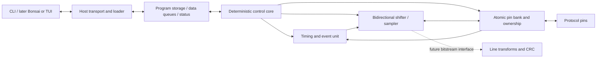

# Protocol emulator construction plan

Status: architecture and integration plan, updated 2026-09-17 for the implemented
`hardcaml_asic` slice (its P0–P3, P4.1–P4.4) and the decision to develop emulator
RTL decoupled from ASIC adoption (section 1). Sizes, rates, and instruction
names remain study parameters, not implemented capabilities or a frozen ISA.

## 1. Direction and scope

Build a small programmable protocol machine in Hardcaml: a deterministic control
core, reusable I/O engines, and reloadable firmware. UART, SPI, and I2C should be
programs over the same mechanisms. The starting rationale is the repository's
[architecture brief](protemu.pdf), especially sections 3, 6, and 8.

The first useful system should load a program, exchange bytes over protocol pins,
and report what happened. Prioritize UART TX/RX, SPI controller/target, and I2C
controller/target in stages. Preserve room for low-speed USB and 10 Mbit Ethernet
by defining bitstream and timing interfaces now; add their expensive engines only
after baseline measurements justify them. Optional Hardcaml Workbench integration
provides development views; a later operator interface uses the same emulator
host API as the CLI and simulator.

The competition currently specifies IHP 130 nm CMOS5L, a maximum of 6x4 Tiny
Tapeout tiles, and a January 18, 2027 submission deadline. Jane Street is studying
a possible expansion to 8x4 and will announce it if it becomes available. Start
with 6x4 and do not assume the expansion. The competition links the template's
**`cmos5l` branch**. Treat its actual floorplan and flow checks as the area
authority; approximate tile or gate counts are only planning aids.
[Competition announcement](https://blog.janestreet.com/protocol-emulator-asic-competition/)

### Stack ownership and document authority

This repository is the first reference application for
[`hardcaml_asic`](../../hardcaml_asic/docs/architecture.md). Its accepted architecture
owns ASIC project/resource/flow contracts; the
[program-memory contract](../../hardcaml_asic/docs/program-memory-contract.md)
owns `Single_port_ram` behavior. This document owns emulator semantics and the
consumer's integration choices. The [phase plan](phase_plan.md) tracks their
implementation; it does not duplicate the helper library's implementation backlog.

| Owner | Responsibilities |
| --- | --- |
| `hardcaml_protemu` | Core, ISA, assembler, firmware, pin ownership, timing/events/transfers, small FIFOs/register file, loader, host API, reference model, and protocol tests |
| Emulator project declaration | Design constructor, requested harness/technology, clocks and I/O assumptions, metadata/pin meanings, resource policies, and justified flow overrides |
| `hardcaml_asic` | Resource contracts/backends, temporary elaboration context, target resolution, immutable build description, constraints/configuration emission, source sets, collateral, and build/run provenance |
| ASIC Tiny Tapeout integration | Required top-level interface validation, metadata schema/generation, target-derived floorplan/power requirements, and flow staging conventions |
| `hardcaml_workbench` | Optional project sessions, supervised jobs, logs, artifact inspection, and development UI through project-owned commands/driver |

The emulator still implements and verifies its wrapper wiring, reset/disable
logic, and loader. Harness validation does not implement these behaviors. P2's
reusable protocol mechanisms remain emulator logic; they do not become ASIC
resources merely because several protocols use them.

The intended ASIC lifecycle is an immutable project declaration, target
resolution, a fresh `Elaboration_context` for the design constructor, resource
registration/selection, validation, and an immutable `Build`. Constructors
discover resources; the project supplies policies rather than a duplicate memory
inventory. Initial builds explicitly select synthesizable flop program storage.
Unsupported requests fail unless an exact supported implementation or explicit
fallback is allowed. Shape, latency, and behavior must not change silently.

Generated RTL source lists, constraints, flow configuration, and TT metadata come
from that build. Protected target/resource facts cannot be replaced by conflicting
raw settings; permitted overrides carry reasons. Clocks have one declaration with
defined conversions to metadata/SDC units. Existing scripts may consume the bundle;
the optional library runner is not required. Tool/PDK preparation remains an
explicit operation outside ordinary elaboration. Migration preserves the current
P0 path until the replacement passes equivalent checks.

The [Workbench architecture](../../workbench/docs/hardcaml_workbench_architecture.md)
keeps this project independently buildable. Workbench integration is optional and
does not gate emulator hardware, ASIC integration, or tapeout. Sibling links use
this workspace's `scaf`, `hardcaml_asic`, and `workbench` checkout names; they are
documentation references, not build dependencies. Reproduction must resolve and
pin dependencies without requiring those developer-local paths.

### Decoupling RTL from the ASIC tooling

Emulator RTL is developed independently of `hardcaml_asic` adoption. The library
touches the design at exactly three points, all at the project top:

1. the program store, constructed by `Single_port_ram.create` with the elaboration
   context;
2. the project declaration: target, clocks, pin meanings, metadata, resource policy,
   and flow overrides;
3. bundle emission and flow staging, which replace the hand-maintained
   `tinytapeout/` configuration.

Everything else is ordinary Hardcaml (`Scope.t -> I.t -> O.t`) with no context
argument: pin bank, synchronizers/events, timers/waits, shift lanes, FIFOs,
register file, decoder/control core, and the loader. The rules that keep it so:

- Modules that use the program store expose its 1RW port (enable, write-enable,
  shared address, write data, read data) as ordinary ports and are written against
  the [program-memory contract](../../hardcaml_asic/docs/program-memory-contract.md),
  not its constructor. `Elaboration_context.t` is not threaded through the hierarchy;
  only the top-level design constructor instantiates the RAM and connects the port.
  [`protocol_core.ml`](../lib/protocol_core.ml) follows this.
- Emulator testbenches use a small contract model of the store: latency-one reads,
  held output while disabled, and poison after a write or for an unwritten word
  ([`test_protocol_core.ml`](../test/test_protocol_core.ml)). Library backend
  conformance stays in `hardcaml_asic`; adoption later reruns consumer checks against
  its behavioral model.
- Do not instantiate Hardcaml `memory`/`Ram` for the program store, and do not rely
  on asynchronous reads or read-during-write behavior the contract leaves unspecified.
- Keep the Tiny Tapeout wrapper and pin map thin and outside the core, so adoption
  replaces configuration authority without restructuring RTL.

Decoupled code does not mean decoupled measurement. The 6x4 area budget and clock
choices still need early physical evidence, gathered in tiers of increasing cost:

| Tier | Command basis | What it answers | Needs |
| --- | --- | --- | --- |
| Generic estimate | `.venv/bin/yowasp-yosys`: `read_verilog; synth -flatten -top M; stat` | Relative cell/flop counts between candidates, in under a second | `.venv` only |
| Liberty-mapped estimate | Same, plus `dfflibmap`/`abc -liberty` and `stat -liberty` against the pinned `sg13cmos5l_stdcell_typ_1p20V_25C.lib` | Approximate CMOS5L cell area per block | Staged PDK (layer 2) |
| Flow synthesis/hardening | Existing `tinytapeout/` scripts, later an emitted bundle | LibreLane-mapped area, placement, routed timing, checks | Full flow environment |

The first two tiers are not LibreLane's synthesis script and carry no timing; label
their results as estimates. Only flow runs close physical items.

A consequence is that the construction stages in section 8 are not a linear
execution order. Emulator adoption of the library (P0.6/P0.7 in the
[phase plan](phase_plan.md)) may be deferred until the library is consumable from a
separate project (ASIC P5.1) and the emulator has a design worth declaring, while
P1–P3 RTL proceeds against the contract. Deferral is bounded: adoption must land
before Stage 3 exits and before Stage 5 measurements count; the phase plan records
the concrete start trigger. The costs of deferral are accepted
explicitly: Stage 0 cannot exit, flow evidence gathered before adoption is labeled
legacy, and late adoption may surface top-level interface, clock, or metadata
mismatches. Keeping the adoption surface limited to the three points above bounds
that rework.

## 2. What exists today

- `lib/protocol_core.ml`: an Idle/Fetch/Decode/Execute scaffold with an 8-bit PC
  and an output bank tied to zero. It drives an external 256x8 program store through
  a contract-conforming 1RW port: fetch issues a read and decode consumes it one cycle
  later, and host writes are accepted only while halted. Decode/execute, readback,
  and image validity are placeholders. `test/test_protocol_core.ml` checks it against
  a contract model of the store.
- `model/`: the independent reference execution model (Dune library `protemu_model`,
  no Hardcaml dependency), covering P1.1 and P1.2. `machine.ml` holds all model state
  and one rising edge; `operation.ml` is the typed mechanism vocabulary with its
  structural validation; `pin_bank.ml`, `input_pins.ml`, `event.ml`, `fifo.ml`, and
  `transfer.ml` are the mechanisms; `program_store.ml` is a contract model of the 1RW
  store. It is kept out of `lib/` so a diagnostic model cannot reach a synthesis
  source set. Transfers are validated and latched but not executed (P2.5), and there
  is no decoder yet (P1.5). Tests are in `test/model/`.
- `lib/protemu_types.ml`: candidate pin/configure/transfer instruction variants.
- `lib/p0_observable.ml` and `bin/generate.ml`: an observable pin/timer circuit
  and working parameterized Verilog emitter, separate from the control scaffold.
- `test/test_hardcaml_protemu.ml` and `tinytapeout/test/tb.v`: focused P0
  Hardcaml/wrapper tests. They do not establish complete pin-bank or UART support.
- `tinytapeout/`: wrapper, metadata, pinned flow inputs, staging and local checks;
  bootstrap/hardening scripts exist, but no completed mapped/physical run is
  recorded. See the [P0 record](../tinytapeout/reports/2026-09-14-p0-tool-path.md).
- `hardcaml_asic` (its [phase plan](../../hardcaml_asic/docs/phase_plan.md), reviewed
  2026-09-17): P0–P3 and P4.1–P4.4 have evidence. Implemented are the
  `Project`/`Elaboration_context`/`Build` lifecycle with resource identity and
  selection policy; `Single_port_ram.create` with a behavioral model and explicitly
  selected flop storage passing a conformance suite; TT/CMOS5L target resolution with
  validated flow configuration; deterministic bundle emission (RTL, source sets, SDC,
  TT metadata, manifest); and run records with structured result collection. Mapped
  CMOS5L synthesis evidence exists for a 4x8 flop-memory example (179 cells, about
  3,480 µm²). Still open: its small physical path (ASIC P4.5), consumer packaging
  and adoption (ASIC P5), and the SRAM investigation (ASIC S). This repository does
  not depend on the library yet; `lib/dune` lists no `hardcaml_asic`.
- Dune, Hardcaml dependencies, and `scripts/with-switch.sh` are already present.

Keep developing this scaffold, but do not let the current 8-bit instruction memory
or fetch/decode sequence determine the final ISA. In particular, byte-addressed
storage and instruction width are separate decisions.

## 3. Initial architecture

Start with one control core and one transfer engine. The transfer engine can
shift TX and RX together, but that does not imply two independently timed serial
channels. Measure whether UART full duplex requires a second small timing/shift
lane. Keep that replication possible without changing the host or pin interfaces.

Use one system clock initially. Dividers generate clock-enable pulses and output
pin transitions, not new internal clock domains. External SPI clocks are observed
as synchronized inputs, with a documented maximum rate and minimum pulse widths.

### Primitive contracts

| Primitive | Initial contract | Why it matters |
| --- | --- | --- |
| Pin bank | `pin_in`, registered `pin_out`, registered `pin_oe`; masked atomic updates of value and enable | Push-pull SPI/UART, I2C drive/release, later bus turnaround |
| Input front end | Two-stage synchronization baseline, coherent registered snapshots, rise/fall detection; configurable filtering considered separately | External edges are asynchronous; filtering changes latency |
| Timing | Countdown, periodic tick, level/edge wait with timeout; phase restart from an observed event | Baud timing, clock generation, receive alignment, stretching |
| Transfer | Configurable bit count/order, separate input/output pin selection, initial output preload, launch/sample phases, internal or observed-edge pacing | Repetitive shifting without a control instruction per bit |
| Event/status | Latched completion/error/timeout, explicit acknowledge, overflow indication | Events remain visible while the core is busy |
| Buffering | Small TX/RX FIFOs with explicit full/empty and ready/valid behavior | Decouple host/core work from a transfer already on the wire |
| Control/storage | Branches, loop counter, small registers, program load/readback, bounded instruction timing | Protocol semantics remain firmware-controlled |

The primitive interfaces should describe mechanisms such as launch edge, sample
edge, and drive mask. Protocol names belong in firmware builders and tests.

### Pins, reset, and ownership

Use eight bidirectional protocol pins as the first logical bank. Represent
tri-state behavior with separate data and output-enable signals inside the core;
the Tiny Tapeout wrapper connects them to the pad-facing interface.

For open drain, always drive a zero: `pin_out = 0`, `pin_oe = drive_low`.
Releasing a pin is `pin_oe = 0`; a board pull-up supplies the high level. Sample
the actual input while driving or releasing. Do not infer a high bus level from
the value we intended to transmit.

A transfer claims its configured output pins until completion or abort. Reject
overlapping software writes or another engine's claim with a sticky ownership
fault. Inputs may be observed by several consumers. Change ownership only at a
defined clock boundary, and commit output value and enable together.

On reset, release protocol pins, clear queue validity and event state, and halt
execution. Do not depend on uninitialized program/data memory. Load and verify a
program before allowing RUN. Define wrapper reset polarity conversion and
synchronized reset release explicitly. Disabling the design should abort work
and release protocol pins; ordinary core waits must leave active engines running.

### Timing and event semantics

Write these rules into the reference model before implementing the ISA:

1. Commands are accepted on a rising system-clock edge when ready and valid are
   both asserted. Their parameters are latched at acceptance.
2. Pin writes take effect at a documented commit edge. A timed command accepted
   at edge `k` with delay `n >= 1` fires at `k+n`. Reject zero delay initially.
   Timed transfer phases must remain independent of instruction-fetch overhead.
3. A level wait may complete immediately if the synchronized condition is already
   true. An edge wait arms for subsequent observed edges, avoiding stale events.
   If a matching event and timeout occur together, the event wins.
4. Completion and error status remain set until acknowledged. Define simultaneous
   set/ack behavior as set-wins, so a new event cannot be erased accidentally.
5. An engine may wait for a FIFO before starting. Once a wire operation starts,
   it may pause only at an explicitly allowed boundary. Otherwise underrun or
   overrun reports a fault and invokes a configured safe abort action.
6. Distinguish core single-step from engine execution. For initial debugging,
   single-step only with engines idle; STOP requests a boundary stop, while ABORT
   releases pins promptly and marks the transaction incomplete.

Two synchronizer stages are a starting implementation, not a guarantee of a
fixed external-edge latency. Clock phase, synchronizer behavior, filtering, edge
detection, control dispatch, and output registers all contribute. Measure the
normal digital latency range and assess metastability reliability separately.
Do not independently synchronize a data bus and assume its bits remain coherent.
For SPI sampling, align SCK, CS, and data pipelines and verify the device's setup
and hold requirements over all relevant input phases.

Record two latency paths: event-to-engine response and event-to-core-decision-to-
pin response. Target modes may need the first even when controller modes work
with the second. A sticky bit records occurrence, not event multiplicity; use an
event counter or queue if a workload must distinguish successive events.

### Transfer descriptor, before opcode encoding

Model descriptors as typed OCaml values first. Candidate fields are TX value,
bit count, bit order, input pin, output pin, optional clock pin, idle output/clock
values, initial delay, launch phase, sample phase, and internal/external pacing.
Validate pin conflicts and impossible phase combinations on issue.

Start with a 32-bit shift register and lengths 1..32 as an experiment. Support
TX-only, RX-only, and simultaneous TX/RX. UART framing can be assembled into a
shift word or sequenced around a data transfer. SPI mode configuration maps to
preload and launch/sample phases. For I2C, begin with explicit drive/sample/wait
steps; a blind eight-bit transfer is insufficient for stretching or arbitration.

Allow an observed event to arm or start a preconfigured operation without a
software round trip. This generic facility is a candidate for UART start-bit
alignment and externally clocked shifts. Add a second descriptor slot only if
gap-free traffic measurements show that software cannot refill in time.

## 4. Minimum control ISA and memory study

| Family | Candidate operations | Initial decision |
| --- | --- | --- |
| State | Load immediate, move, add/subtract, AND/OR/XOR, compare | Small register set, simple flags; omit multiply/divide |
| Flow | Jump, branch on flag/event/pin snapshot, decrement-and-branch, halt | Publish cycle counts for every path |
| Pins | Masked value/enable write, read snapshot | One atomic pin commit |
| Time | Wait cycles, wait level/edge with timeout | Wait stalls control, not engines |
| Engine | Configure, issue transfer, wait completion, read result/status | Configuration can take several instructions |
| Data | FIFO push/pop and status | Specify blocking and nonblocking forms before encoding |

Use an OCaml assembler/library with labels and validation before designing a
textual DSL. Firmware helpers such as `uart_tx` should expand into this ISA.
Keep the instruction specification shared by assembler and decoder, while the
reference execution model stays independent of the Hardcaml implementation.

Compare fixed 16-bit instructions with occasional extension words against a
simple fixed 32-bit encoding. Start the study with eight 16-bit registers,
128/256 memory words, and 4/8/16-entry byte FIFOs. These are sweep points.
Instruction width and physical memory-word width are separate choices: record
packing, extension-word layout, byte order, and fetch count for each encoding.
Record firmware size, cycles per operation, and mapped area for each choice.

For perspective, 256x16 program bits plus two 16x8 FIFOs already total 4,352
storage bits before registers and metadata. That can dominate a small design if
implemented in flip-flops. Use `hardcaml_asic.Single_port_ram` through the
elaboration context at the project top, with consumers coded against its port
(section 1, decoupling). Its normative contract is single-port 1RW with one shared
address, latency one, held output when disabled, unspecified output after a
write, and no initialization/reset. An enabled operation is a read or a write;
the primitive supplies neither byte enables nor a second read port. Out-of-range
accesses are outside its contract. Small FIFOs and the multi-port register file
remain emulator-owned flop logic in the initial implementation.

The loader assembles complete configured memory words before issuing writes;
this does not select a 16-bit ISA. Initially both host program writes and readback
require the core halted and engines idle. Requests during execution are rejected
without stealing a fetch cycle. Concurrent access would require a new arbitration
and timing contract or another memory shape. Status/data-queue host operations
remain separate from this program-memory restriction.

The emulator owns program validity, access gating, bounds/loaded-image validation,
and fetch-pipeline validity. Reset validity and halt execution without bulk-resetting
RAM. Load, read back, and verify a complete declared image before RUN; prevent
fetch outside that verified image and reject partial transport words. A write or
an unwritten location must never supply a valid instruction. Model fetch latency,
stalls, branches, and extension fetches independently of the RAM implementation.
Any ROM is a deliberate hardware implementation, not an assumed power-up file load.

Start with an explicitly selected flop implementation. Investigate CMOS5L macro
availability early, but begin a macro backend only after exact shape/behavior,
complete model/Liberty/LEF/GDS and power views, target permission, and flow
compatibility are established. PDK presence alone proves none of the latter
requirements. The helper library owns backend implementation/conformance; the
emulator owns workload/area comparisons and target acceptance evidence. Unsupported
macro-required builds fail; fallback requires explicit policy and a recorded reason.
The first working slice and first ASIC project do not wait for a macro.

## 5. Protocol milestones and acceptance tests

The rates below are proposed test targets, conditional on routed timing and the
board interface. Support one selected protocol at a time initially.

| Protocol | First demonstration | Baseline completion | Important failure/timing tests |
| --- | --- | --- | --- |
| UART | Programmable 8N1 TX at 115,200 baud, then RX | Back-to-back TX/RX; sweep toward 1 Mbaud; evaluate simultaneous independent TX/RX | Start detection at varying clock phases, false start, framing error, baud mismatch sweep, FIFO faults |
| SPI controller | Mode 0 byte exchange | All four CPOL/CPHA modes, both bit orders, selected widths 1..32, CS across multiple words; study 1 MHz then 5 MHz | First/last-bit placement, CS timing, pause boundaries, unequal half-periods |
| SPI target | Preloaded response at a conservative clock | All four modes within a measured external-clock envelope | CS assertion/abort, first-bit preload, minimum SCK high/low time, setup/hold, underrun; target cannot stretch SCK |
| I2C controller | 100 kbit/s, 7-bit address, write/read with ACK/NACK | Repeated START, final-read NACK, STOP, clock-stretch wait and timeout; evaluate 400 kbit/s | Released SCL still low, stuck bus, NACK paths, arbitration loss injection and release |
| I2C target | Address match and one-byte response | Read/write sequences, repeated START/STOP, ACK/NACK, intentional stretching | SDA stability while SCL high, external STOP during waits, response latency, read termination |

I2C terminology, bus behavior, and timing should follow
[NXP UM10204](https://www.nxp.com/docs/en/user-guide/UM10204.pdf).
Model the pull-up and multiple open-drain drivers in the testbench. Full
multi-controller clock synchronization/arbitration, 10-bit addressing, and faster
I2C modes are later coverage; detecting a forced arbitration loss alone is not
complete multi-controller support.

UART full duplex is an explicit architecture decision after the single-lane
measurements. A duplex SPI shifter uses one shared bit clock; two UART directions
can have unrelated frame starts and require independent schedules.

## 6. Keeping USB and Ethernet possible

Reserve a logical bitstream boundary with data, valid/ready, stream boundaries,
and error metadata. Future transform stages must distinguish a logical bit
consumed from a physical symbol emitted: stuffing changes the relationship.
Backpressure inside the chip must never silently stretch an in-progress waveform.
Define buffer sizing and abort behavior before claiming continuous streaming.

Candidate later primitives:

- Bit-serial configurable CRC/LFSR, initially widths up to 32. Specify polynomial
  representation, shift direction, initialization, reflection, and final XOR.
  Start with one logical bit per tick; compare byte-parallel area only if needed.
- Stateful invert/XOR/NRZI and Manchester transforms; configurable run-length
  insertion/removal. Compare a small set of reusable operations against a LUT/FSM
  implementation using measured area and achievable symbol rates.
- Edge-interval capture and phase correction for receive clock recovery.
- Descriptor chaining and sustained FIFO service where packet timing requires it.

For USB low speed, first model logical line states, NRZI, stuffing, CRC5/CRC16,
and packet boundaries, then test receive recovery and response deadlines. A
packet loopback test is distinct from a usable device with enumeration, reset,
control requests, and turnaround handling. Keep protocol semantics in firmware.
Use the [USB 2.0 specification](https://www.usb.org/document-library/usb-20-specification)
as the reference when fixing those requirements.

For Ethernet, choose the electrical boundary before promising 10BASE-T support:
a digital connection to an external PHY and generating/recovering Manchester at
a line interface are different projects. Start with a modeled bitstream, CRC32,
and framing throughput. A direct line-interface study must also cover receive
clock recovery, link behavior, and any required collision behavior. Budget pins
and host bandwidth for whichever boundary is selected.

Illustrative arithmetic, assuming a *hypothetical* 48 MHz system clock:

| Workload | Available clock budget | Implication to investigate |
| --- | --- | --- |
| 1 Mbaud UART | 48 cycles/bit | Plenty of bit time, but RX phase and dispatch latency still matter |
| 5 MHz SPI | 4.8 cycles/half-period on average | Exact uniform half-periods need a compatible clock/divider; phase-dependent target response is tight |
| 1.5 Mbit/s USB low speed | 32 cycles/bit | Plausible study point for autonomous timing; not a compliance result |
| 10 Mbit/s Manchester stream | 4.8 cycles/bit, 2.4 cycles/half-bit on average | Receive recovery and non-integer timing are major constraints |

48 MHz is not an achieved ASIC clock. Compare suitable external clock choices
and integer/fractional schedules; quantify jitter before using fractional ticks.
Neither generic GPIO nor successful digital simulation establishes a compliant
USB or Ethernet electrical interface. Board transceivers, pull-ups, line drivers,
termination/magnetics as applicable, voltage levels, and Tiny Tapeout I/O delay
belong in the feasibility study. Extensibility before fabrication still requires
real hardware resources; a future firmware update cannot add a missing PHY.

## 7. Host control now, application later

Define a transport-independent OCaml host API: identify/version/capabilities,
load/read program, configure pins, enqueue/dequeue data, run/stop/abort, inspect
registers and engine status, and retrieve bounded trace events. Program-memory
readback and writes initially require halted execution and idle engines, as in
section 4; inspection of status is not a second memory port. Make protocol
examples runnable through a simulator backend before real hardware exists.

A proposed first physical loader is a slow clocked serial debug link using
dedicated Tiny Tapeout inputs and an output. It must operate with the protocol
core halted so an empty or broken program remains recoverable. Its fixed loader
logic is infrastructure, separate from the programmable protocol bank. Specify
framing, maximum host clock, command acknowledgement, length/error checks, and
flow control before implementation. Start without concurrent program writes.

Keep register addresses and binary transport versioned; expose capabilities for
memory width/depth, pin count, engines, and ISA version. A CLI should load firmware,
send/receive bytes, and export timestamped traces. Keep these commands usable
without a UI. A later operator interface can use the same API through a local
service, with its placement decided after the device workflow works.

Development integration with Hardcaml Workbench is a separate optional track:
generic Dune commands first, then a small versioned manifest and a project-side
driver built in this project's environment. The driver exposes target/configuration
discovery, elaboration, generation, tests, and ASIC build/run artifacts as supported
by the Workbench protocol. It reads project declarations/builds rather than copying
target, clock, or memory policy into a second configuration authority. Workbench
owns the job and UI; the ASIC adapter owns build/flow semantics. Link Workbench
jobs/artifacts to ASIC build and execution identities.

Use Workbench's generic hierarchy, waveform, log, and report views where supported.
Emulator firmware loading, data exchange, and recovery remain P3 API operations;
a device-control extension is not yet specified by Workbench. Bonsai Web is already
Workbench's primary frontend. An emulator operator UI or terminal client remains
a separate product decision; neither is required for hardware acceptance.

## 8. Construction sequence

| Stage | Deliverables | Exit evidence |
| --- | --- | --- |
| 0. Make the tool path real | Observable pin/timer path; ASIC project declaration and emitted bundle; small registered flop-memory integration; prepared physical environment | Wrapper regression, memory integration and mapped synthesis pass; an adopted-bundle design completes CMOS5L hardening/precheck and gate-level checks |
| 1. Define execution | Cycle model, typed instructions/descriptors, pin/timing contracts, assembler helpers | UART/SPI/I2C examples execute in the model; latency and program-size report |
| 2. Implement primitives | Pin bank, synchronization/events, timer, shifter, small FIFOs, unit tests | Model/RTL agreement and edge-case properties; mapped area per block |
| 3. Make it reloadable | Control core, context-registered program store and consumer validity/arbitration, independent loader, CLI simulator/device API | Load/readback/run two different protocol programs without regenerating RTL |
| 4. Complete baseline | Firmware and independent peers for UART, SPI controller/target, I2C controller/target | Coverage matrix with rates, timing margins, faults, and concurrency limits; FPGA exercise if available |
| 5. Select physical architecture | Memory/FIFO/engine sweeps; repeated place and route; USB/Ethernet feasibility experiments | Chosen configuration fits the authorized 6x4 allocation with routed timing and resource margin; stretch limits documented |
| 6. Prepare tapeout | Reproducible ASIC bundle/export and dependency resolution, gate-level regression, physical checks, pinout and bring-up guide | Complete submission artifacts with tool/PDK revisions, timing results, clean required checks, and recovery procedure |
| Later. Application | Optional Workbench driver/artifact integration and an operator interface over the host API | Independent CLI remains usable; supported views preserve build/run identity and device operations/errors |

Stages 0 and 1 should interleave: a small early physical-flow experiment gives
useful evidence while the model prevents premature commitment to a large ISA.
Run two tracks alongside each other: emulator model/RTL work, and the helper
library's implementation followed by emulator adoption in P0.6/P0.7. The stages are
not a strict execution order (section 1, decoupling): P1–P3 RTL, including the
program-store consumer logic, proceeds against the memory contract, and adoption
may land after later stages have progressed. Only the context-registered program
store at the project top and Stage 0's exit depend on adoption.
Early macro investigation informs P5 without blocking either track. Workbench,
an SRAM macro, and commercial EDA adapters are not initial prerequisites.
Do not wait for USB/Ethernet or a finished CPU to discover memory/routing costs.
The flow directory and required tools are described in
[`tinytapeout/README.md`](../tinytapeout/README.md).

## 9. Verification and measurements

Use three layers: an independent cycle-level model, Hardcaml simulation, and
tests of emitted Verilog through the Tiny Tapeout wrapper. Use external protocol
peer models with assertions on wire timing; self-loopback alone can hide a
matching encoder/decoder bug. Randomize asynchronous phase, bounded jitter,
resets, CS interruptions, stretch length, and queue starvation.

`hardcaml_asic` owns memory backend conformance. Its scoreboard compares only
contract-defined values across backends and checks disabled-output hold within
each backend, including after an unspecified result. Poison initialization and
post-write poison belong to the behavioral model, not synthesized storage.
Emulator integration tests separately assert valid instruction consumption,
shared-port access rules, whole-word loading, and recovery; vary unspecified
values where useful. Link library conformance evidence without duplicating its
backend test implementation here.

Apply formal properties where they add value: no double pin ownership, open-drain
never drives high, bounded FIFO occupancy, no loss/duplication at handshakes,
reset releases pins, waits terminate on a qualifying event or configured timeout.
Write down environmental assumptions, especially minimum external pulse widths.

Per architecture candidate, record instruction/data storage bits, firmware words
per protocol, mapped sequential/combinational area, routed utilization, worst
setup/hold slack, clock target, min/max observed edge response, maximum verified
protocol rate, FIFO service budget, and errors under overload. A B-byte FIFO at
R bits/s absorbs only about `8*B/R` seconds without service, before framing and
other overhead. Sustained host throughput must be measured separately. Early area
comparisons may use the yowasp-yosys estimate tiers from section 1; record which
tier produced each number and do not report estimates as mapped or routed results.

Every candidate identifies the immutable ASIC build manifest: source/dependency
revisions and content hashes (including dirty/untracked inputs), resource requests
and selections/fallback reasons, distinct simulation/synthesis source sets,
collateral, constraints, resolved configuration, and override reasons. Preserve
input content as well as hashes. A separate execution record captures actual
tools/environment, commands, completion status, logs, reports, and output hashes;
running a flow does not mutate the build manifest. Link firmware, test seeds,
and modeled/RTL/routed/board coverage to these identities. Missing measurements
remain `not run` or `unknown`; an emitted bundle is not physical closure. Use
[`tinytapeout/reports/README.md`](../tinytapeout/reports/README.md) for the record format.

## 10. Decisions to resolve with evidence

| Decision | Proposed starting point | Evidence needed before committing |
| --- | --- | --- |
| Core and engine count | One core, one duplex shift lane | Independent UART RX/TX and target-mode reaction measurements |
| ISA encoding | Compare 16-bit plus extensions with 32-bit fixed | Program sizes, decoder area, and instruction timing |
| Program storage | `Single_port_ram`, 1RW, latency one, explicit flop implementation; host access halted and engines idle | Width/depth/packing and total placed area; macro capability gate before a supported backend comparison |
| Clock/rates | Sweep clocks in simulation and physical constraints | Routed timing, pad/board path, and protocol jitter budgets |
| Filtering | Synchronization first; per-input filtering if required | Glitch rejection versus latency and protocol pulse widths |
| Host link/pin map | Dedicated inputs/output for debug; eight `uio` protocol pins | Loader complexity, bandwidth, and bring-up wiring |
| Stretch boundary | Modeled USB/Ethernet bitstreams first | Actual electrical interface and continuous service budget |
| Flow integration | Emulator-owned declaration through `hardcaml_asic`; generated TT/LibreLane bundle consumed by scripts | Adapter staging, configuration authority/conflict checks, provenance, and clean reproduction |
| Workbench/operator UI | Optional driver for development; P3 host API for device operations | Versioned integration support and a concrete operator workflow; no hardware gate |

The first implementation slice should be **pin bank + timer + cycle model +
working RTL emitter**, exercised by a programmable UART transmit sequence. Then
add receive/event behavior and SPI shifting before expanding the control core.
Alongside it, prove the ASIC declaration and small registered program-memory path
before integrating the full reloadable system.
